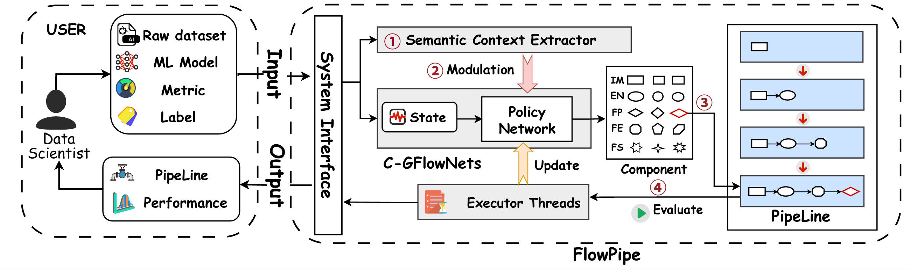

# FlowPipe: LLM-Enhanced Conditional Generative Flow Networks for Data Preparation

[](./LICENSE)
[](./flowpipe)
[](https://www.python.org/)

> \> **FlowPipe** is a unified framework that reformulates data preparation pipeline synthesis as **conditional probabilistic flow generation**. By leveraging **C-GFlowNets** and **LLM-driven Deep Semantic Modulation**, it addresses the structural and semantic limitations of traditional reinforcement learning approaches.



---

## 🚀 Performance Highlight

FlowPipe achieves **SOTA performance** on standard data preparation benchmarks, significantly outperforming previous baselines like CtxPipe and DiffPrep, while maintaining superior inference speed.

| Method              | DiffPrep (Acc) | DeepLine (Acc) | Inference Time (s) |
| :------------------ | :------------: | :------------: | :----------------: |
| DiffPrep            |                |                |                    |
| HAIPipe-AI          |     0.760      |     0.801      |       22.195       |
| CtxPipe             |     0.806      |     0.813      |       65.203       |
| **FlowPipe (Ours)** |   **0.896**    |   **0.912**    |     **51.516**     |

---

## 🏗️ Overview

Automated pipeline construction remains computationally prohibitive due to the combinatorial complexity of operator sequences. While previous SOTA Multi-DQN architectures provide a search paradigm, they suffer from fundamental limitations:

1.  **Structural Dissonance:** Decoupled value estimators hinder long-horizon credit assignment.
2.  **Semantic Detachment:** Dataset context is treated as a superficial additive bias rather than strictly conditioning the agent's reasoning.
3.  **Exploration Inefficiency:** The optimization landscape is vast and sparse, filled with invalid pipeline states.

**FlowPipe** resolves these challenges by modeling pipeline synthesis over a directed acyclic graph (DAG) using a **Conditional Generative Flow Network (C-GFlowNets)** optimized via a **Trajectory Balance** objective.

### Key Innovations

- **🔄 Holistic Credit Assignment (C-GFlowNets):**
  Unlike standard RL, FlowPipe employs a **Trajectory Balance (TB) objective**, establishing a direct gradient path from terminal validation rewards to early actions. This ensures that every step in the pipeline generation receives accurate credit assignment.

- **🧠 Deep Semantic Modulation via FiLM:**
  To resolve *semantic detachment*, we introduce a **Feature-wise Linear Modulation (FiLM)** mechanism. This allows **LLM-derived logical priors** to *multiplicatively modulate* the policy's internal activation maps, structurally adapting the decision logic to the specific dataset context rather than just adding bias.

- **🚫 Failure-Aware Exploration:**
  FlowPipe incorporates **failure awareness** directly into the flow objective. This mechanism prunes semantically invalid states early, allowing the agent to concentrate search mass on high-potential regions and avoid sparse, invalid areas of the optimization landscape.

---

## 🛠️ Installation

### 1. Environment Setup

We recommend using [Anaconda](https://www.anaconda.com/download) for environment management.

1. Clone this repository:
   ```bash
   git clone [https://github.com/your-username/flowpipe.git](https://github.com/your-username/flowpipe.git)
   cd flowpipe

1. Create and activate the conda environment (Python 3.8):

   Bash

   ```
   conda create -n flow python=3.8
   conda activate flow
   ```

2. Install required packages:

   Bash

   ```
   # Option A: Install via pip (recommended)
   pip install -r requirements.txt --extra-index-url [https://download.pytorch.org/whl/cu113
   
   ```

### 2. LLM Configuration

FlowPipe utilizes **Llama-3.1-8B-Instruct** for semantic understanding.

1. Download the model from [Hugging Face](https://huggingface.co/meta-llama/Llama-3.1-8B-Instruct/tree/main).

2. Place the model files in the `./LLM/LLMs` directory. The structure should look like this:

   Plaintext

   ```
   ./LLM/LLMs/
   └── Llama-3.1-8B-Instruct/
       ├── config.json
       ├── model.safetensors
       └── ...
   ```

### 3. System Configuration

Open the configuration file `config.py` (located in the root folder) and modify it to reflect your target environment (e.g., GPU device IDs, absolute paths).

------

## 💾 Datasets

FlowPipe is trained and evaluated on datasets from HAIPipe, DiffPrep, and DeepLine. Please download them and place them in the corresponding subfolders under `./data/`.

| **Dataset Source** | **Download Link**                                            | **Target Local Path**      |
| ------------------ | ------------------------------------------------------------ | -------------------------- |
| **HAIPipe**        | [Link](https://github.com/ruc-datalab/Haipipe?tab=readme-ov-file#dataset) | `./data/dataset/`          |
| **DiffPrep**       | [Link](https://github.com/chu-data-lab/DiffPrep/tree/main/data) | `./data/diffprep_dataset/` |
| **DeepLine**       | [Link](https://github.com/yuvalhef/gym-deepline/tree/master/gym_deepline/envs/datasets/classification/train) | `./data/deepline_dataset/` |

------

## 🏃 Usage

### Training

To train the Conditional GFN agent:

Bash

```
# Start training from scratch
python train_gfn.py
```

### Testing

To evaluate the model performance or run scalability tests:

Bash

```
# Test on a specific range of steps
python test_gfn.py

```

------

## 📚 Baselines Setup

We compare FlowPipe against the following state-of-the-art systems:

| **System**   | **Repository**                                               | **Recommended Environment** |
| ------------ | ------------------------------------------------------------ | --------------------------- |
| **CtxPipe**  | [ctxpipe/ctxpipe](https://github.com/ctxpipe/ctxpipe)        | Python 3.8                  |
| **DiffPrep** | [chu-data-lab/DiffPrep](https://github.com/chu-data-lab/DiffPrep) | Python 3.9, Torch 1.8.1     |
| **DeepLine** | [yuvalhef/gym-deepline](https://github.com/yuvalhef/gym-deepline) | Python 3.6, TF 1.15         |
| **HAIPipe**  | [ruc-datalab/Haipipe](https://github.com/ruc-datalab/Haipipe) | Python 3.8, Torch 1.10      |
| **SAGA**     | [damslab/reproducibility](https://github.com/damslab/reproducibility) | OpenJDK 11                  |

------

## 📂 Repository Structure

- `flowpipe/`: Main source code for the GFN agent, environment, and pipeline logic.
- `scripts/`: Utility scripts (e.g., experimental data cleaning).
- `env.py`: Global environment initialization and experimental setup.
- `config.py`: Configuration parameters for training and testing.
- `deterministic.py`: Settings to ensure reproducibility.
- `comp.py`: Core components, including models and algorithm implementations.
- `util.py`: Helper functions for filesystem and memory management.


